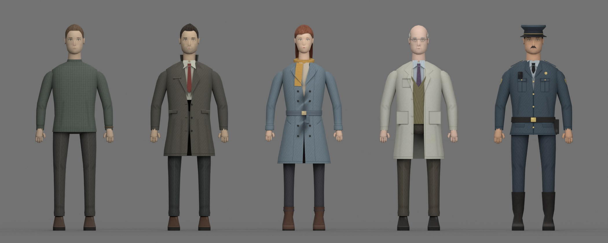
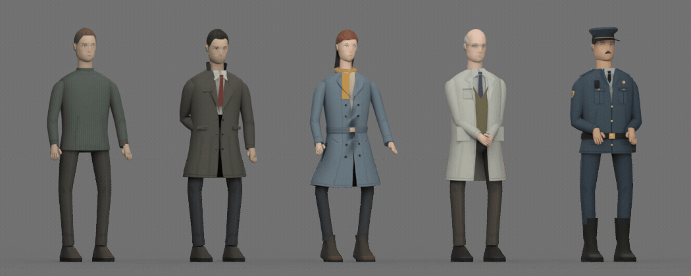
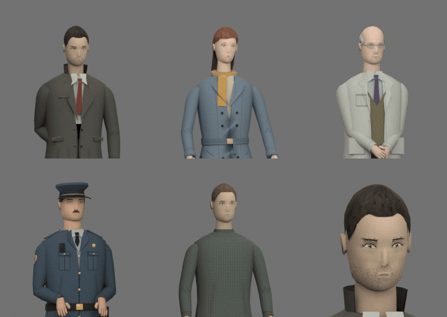

# PS1 character art pipeline

Five original low-poly characters for the first prototype: the shared base figure, Alexey
Voron, Elena Voron, Dr. Ilya Morozov and a police officer. Every mesh, face and garment
texture is generated by repository-owned Python inside Blender. No photographs, scanned
heads, external meshes or third-party textures are used. The target is a readable PS1-era
look — clear silhouettes, restrained palettes and small point-filtered textures — not realism.



## Rebuild

From the repository root, with Blender **4.5.3** at `.tools/blender/blender`:

```sh
.tools/blender/blender --background --factory-startup \
  --python Tools/Blender/generate_ps1_characters.py -- --publish-media --animation-previews
```

The run regenerates textures, the source scene, metrics, animation clips and FBXs. It runs
geometry and animation checks, renders neutral-light reviews to `.artifacts/character-pipeline/`,
and re-imports every FBX into an empty scene for validation. `--animation-previews` renders the
Idle and Talk GIF/MP4 previews (about 20 minutes on a 4 vCPU sandbox; `--preview-scale 0.5` for
drafts). `--publish-media` copies the inspected reviews to `Docs/Media/`; `--skip-render`,
`--samples` and `--resolution` control the Cycles reviews. `--skip-fbx-validation` is only for
diagnosing an importer failure. The animation previews need `ffmpeg` on `PATH`.

Edit the sources, not exported FBXs or PNGs:

| Source | Contents |
| --- | --- |
| `Tools/Blender/character_models.py` | Shared rig, head shapes, hair, bodies, garments, accessories and per-character recipes |
| `Tools/Blender/character_textures.py` | Face-map painter and per-character clothing atlases |
| `Tools/Blender/character_animations.py` | Control rig, per-character Idle and Talk choreography, clip checks |
| `Tools/Blender/generate_ps1_characters.py` | Build order, geometry checks, reviews, FBX export and round-trip validation |
| `Tools/Blender/pixel_art.py` | PNG canvas, item icons and bitmap font |

## Generated files

| Purpose | Path |
| --- | --- |
| Shared rig and base figure | `Assets/_Game/Art/Characters/CharacterBase.fbx` |
| Alexey Voron | `Assets/_Game/Art/Characters/AlexeyVoron.fbx` |
| Elena Voron | `Assets/_Game/Art/Characters/ElenaVoron.fbx` |
| Dr. Ilya Morozov | `Assets/_Game/Art/Characters/DrIlyaMorozov.fbx` |
| Police Officer | `Assets/_Game/Art/Characters/PoliceOfficer.fbx` |
| Face maps (Face and Eyes meshes) | `Assets/_Game/Art/Textures/Faces/*_Face.png`, `*_FaceTalk.png`, `*_FaceBlink.png` (128×128) |
| Clothing atlases (all other meshes) | `Assets/_Game/Art/Textures/Characters/*_Clothing.png` (256×256) |
| Item icons | `Assets/_Game/Art/UI/Icons/*_32.png` (32×32) |
| Bitmap glyph atlas and map | `Assets/_Game/Art/UI/Font/PS1Bitmap5x7.png`, `PS1Bitmap5x7.json` |
| Editable Blender scene | `SourceArt/Characters/PS1CharacterPipeline.blend` |
| Per-component topology, rig and texture metrics | `SourceArt/Characters/character_metrics.json` |
| Inspected reviews | `Docs/Media/CharacterLineupFront.jpg`, `CharacterLineupThreeQuarter.jpg`, `CharacterLineupBack.jpg`, `CharacterStride.jpg`, `CharacterFaces.jpg` |
| Inspected animation previews | `Docs/Media/CharacterIdle.gif`, `Docs/Media/CharacterTalk.gif` |

Reviews are Blender Cycles CPU renders under neutral light, not Unity captures. The stride
review poses the legs and arms to expose coat, sleeve and trouser deformation.

## Characters

| Character | Silhouette and costume | Triangles | Height |
| --- | --- | ---: | ---: |
| Character Base | Neutral crew-neck sweater, trousers, short even hair | 2,952 | 1.801 m |
| Alexey Voron | Knee-length charcoal overcoat with standing collar, shirt and dark red tie; side-parted dark hair, tired lids, stubble | 3,351 | 1.806 m |
| Elena Voron | Belted double-breasted blue-gray coat, mustard scarf, heeled ankle boots; long auburn hair tucked behind the ears, freckles | 3,998 | 1.795 m |
| Dr. Ilya Morozov | Pale lab coat over an olive knit vest, shirt and plum tie, pens, wire glasses; gray horseshoe hair, wrinkles | 3,234 | 1.790 m |
| Police Officer | Peaked cap, belted tunic with epaulettes, radio, holster and badge, tall boots; broad jaw, chevron mustache | 3,337 | 1.792 m |

Heads differ in scale, jaw, chin, cranium, nose, brow and cheek shape; bodies differ in
garment cut, shoulder line, belly or waist, and limb thickness. Full per-component counts are
in `character_metrics.json`.

## Idle and Talk animations





Every FBX carries two 24 fps takes baked from Blender NLA tracks: **Idle**, a seamless 6.0 s
loop, and **Talk**, a 4.0 s one-shot that starts and ends in Idle's first pose, so the Animator
can blend in and out at any time.

| Character | Idle | Talk |
| --- | --- | --- |
| Character Base | Neutral stance, contrapposto weight shift, one glance | Right palm-up offer, then both hands open |
| Alexey Voron | Tired slouch, right hand in the coat pocket, a sigh and a glance down | Left hand only: palm-up explanation, a shrug, then a small point; the pocket hand stays |
| Elena Voron | Weight on one hip, head tilt, quicker breathing, glances aside | Both hands expressive, a shrug in the pause, a head shake while pointing |
| Dr. Ilya Morozov | Stiff upright stance, hands clasped in front, looks down "over the glasses" | Right hand leaves the clasp for a lecturing gesture, then returns; nods |
| Police Officer | Chest out, chin up, hands on the belt, slow head scans | Right hand leaves the belt: a "stop" palm, then points ahead; firm nods |

- All clips share breathing, pelvis sway and head micro-motion layers, so the loop never
  freezes. Talk adds an inhale before each phrase and nods on six speech beats.
- Legs use IK against planted feet; pelvis sway produces the knee bends. Pocket, clasp and belt
  holds use IK hand targets. These control bones (`CTRL_*`) are non-deforming and are not
  exported; the FBX exporter bakes their result into the 19 deform bones.
- Lip movement and blinking are texture swaps, not bones. The `Face` renderer switches to
  `*_FaceTalk.png` on a deterministic syllable pattern inside two speech windows of the Talk
  clip; the `Eyes` strip switches to `*_FaceBlink.png`. Unity (`FacePerformance`) and the
  preview renders use the same timing. Blinks are random in the game and fixed in the previews.

The `Left*` bones sit on the character's anatomical left (Blender +X, Unity -X). The `Eyes`
strip covers two face-grid rows, so a blink map replaces the whole painted eye opening.

## Rig, meshes and UVs

Every FBX contains one shared Generic-style deform skeleton with identical bone names,
parents and rest transforms, and seven skinned meshes: `Body`, `Head`, `Face`, `Eyes`,
`Hair`, `Clothing` and `Accessories`.

```text
Armature
└── Hips
    ├── Spine
    │   └── Chest
    │       ├── Neck
    │       │   └── Head
    │       ├── LeftShoulder/LeftUpperArm/LeftLowerArm/LeftHand
    │       └── RightShoulder/RightUpperArm/RightLowerArm/RightHand
    ├── LeftUpperLeg/LeftLowerLeg/LeftFoot
    └── RightUpperLeg/RightLowerLeg/RightFoot
```

Animator transform paths start at the imported model root, then `Armature`, for example
`Armature/Hips/Spine/Chest/Neck/Head`. Blender is Z-up with faces toward local -Y; FBX export
uses Y-up with the `-Z` forward conversion for Unity's +Z-forward scenes. Models stand on the
ground plane in a relaxed A-pose. Weights are normalized with at most four influences.

- **Face and Eyes** use planar UVs in unscaled head space, so every head shares one face-map
  layout and any face map fits any head. Eyes, brows, lips and stubble are painted; `Eyes` is
  the eye-opening strip of the same surface.
- **All other meshes** share one 256 px atlas with fixed islands for torso front and back,
  sleeves, trousers, hair, skin, shirt, accents, lining, leather, metal and knit.
- Torso garments use arc-length UVs so their flanks are not stretched; coats have an inner
  lining shell and hem band so they read as solid from any angle.
- No torso skin exists under clothing. Thighs under long coats are slim and coat skirts blend
  from `Hips` toward `UpperLeg`, so strides do not push legs through the skirt.

## Unity import notes

- Import all five FBXs as **Generic** rigs. The editor builder creates `Character_Base` from
  `CharacterBase.fbx` and the four variants from their own FBXs.
- The builder assigns `M_Face_*` to both the `Face` and `Eyes` renderers, and
  `CharacterAppearance` swaps `CharacterData.FaceTexture` on both through a property block.
- The builder copies each FBX's `Idle` and `Talk` takes into editable `.anim` clips and gives
  every variant an `AnimatorOverrideController` on the shared `AC_Character`. Importers use
  `preserveHierarchy`, so clip paths keep the `Armature/` prefix, and keyframe reduction with
  0.05° / 0.05 % tolerances. Unity's defaults (0.5° / 0.5 %) would let the planted Idle feet
  drift by up to about a centimetre.
- Use point filtering, no mipmaps and no lossy compression for face maps and atlases.
- `PS1Bitmap5x7` is an original glyph atlas plus a JSON map, not a Unity `Font` asset. A
  custom Canvas renderer must use each glyph's top-left pixel rectangle, convert Y with
  `atlasHeight - (y + height)` and use the supplied `advance` with an 8-pixel line height.
- The four 32×32 icons are hand-drawn pixel graphics for the badge, photograph, key and
  medical file; they are not substitutes for the `ItemData` assets.

Animator Controllers, the Walk/Run/Turn/Inspect/Death clips, prefabs, materials and
ScriptableObjects are created by the Unity editor builder, not by this pipeline.

## Checks and provenance

Before export the generator checks the component set, bone names and parents, the
1,500–5,000 triangle budget, the 500-triangle face shell, 0–1 UVs, normalized weights, at most
four influences and model height. Geometry checks also require soles on the ground, no torso
skin under clothes, an unobstructed face, and crown hair that covers the scalp along 108
rays. Exported FBXs are re-imported to check names, skeleton, skin groups, texture sizes and
bounds; rotating `LeftUpperArm` must deform the skinned body.

Animation checks require Idle to close its loop and Talk to start and end in Idle's first
pose (0.1 mm, 0.05°), feet to stay within 1 mm of their rest positions, every IK hold to be
reached within 4 mm, and Alexey's pocket hand to stay behind the coat vertex by vertex. After
export, the re-imported `Idle` and `Talk` takes must reproduce the source joints within 3 mm
and 1.5°.

These are Blender checks only. Unity import, Animator playback and Play Mode remain
unverified until a licensed editor runs the project. The pipeline uses no external meshes,
textures or photographs; recheck provenance whenever external material is introduced.
